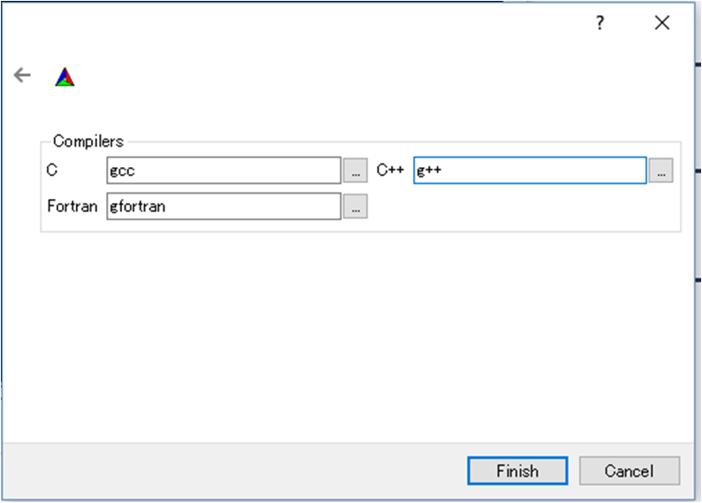
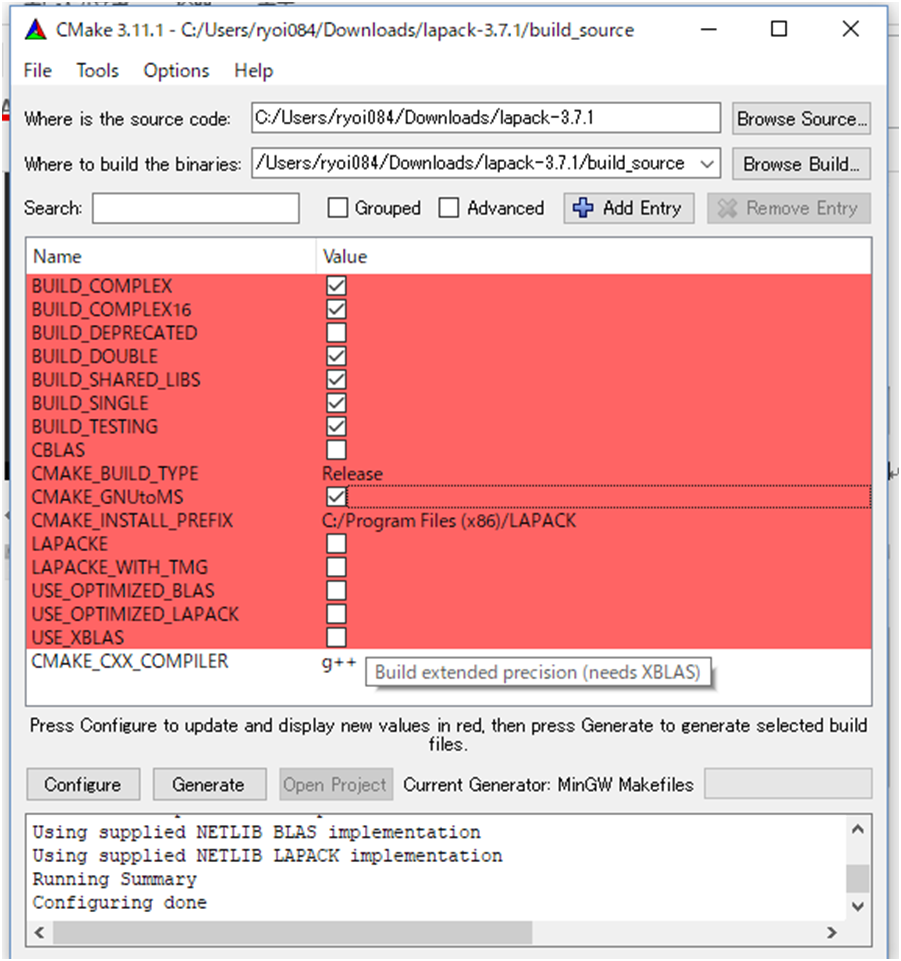

# BLAS, LAPACK の導入方法

blasやlapackを用いると, 行列の様々な計算や数値計算などが簡単かつ高速に実行できるようになります.

fortranやc言語, pythonなどでも使われているとても強力なパッケージです.

## Macへのインストール方法

Homebrew を導入していると思うので, Terminalを開いて次のように打ってみてください.

```
  brew install blas lapack
```

これのみで完了です.

何らかのfortranのファイル(foo.f90)をコンパイルするときに

```
  gfortran foo.f90 -lm -lblas -llapack
```

と入力して問題なく動けば正常にインストールされています.

## Windowsへのインストール方法

Windowsへのインストールは実はかなり面倒くさいです...

[こちらのサイト](http://icl.cs.utk.edu/lapack-for-windows/lapack/)の下のほうを参考に入れていきます.

1. [lapack.tar.gz](http://netlib.org/lapack/lapack.tgz)からファイルをダウンロードします.

2. [CMAKE](https://cmake.org/download/)の *.msi* のイントーラーをダウンロードします.

3. CMAKEをインストールする. この際PATHを通しておくと楽./

4. 管理者としてコマンドプロンプトを開き, ダウンロードしてきた *lapack-3.* のフォルダに移動します.

5. *build*, *build_space* という二つの新しいフォルダを作成します.
  > ``` mkdir build build_space ```

6. cmake-guiを開きます. 次のコマンドを打ってください.
  > ``` cmake-gui ```

7. lapack-3.の中に *CMakeLists.txt* というファイルがあるので, エクスプローラからCMAKEのウインドウへとドラッグ&ドロップします.

8. Browse Build... というボタンを押して, 先程作成した *build_space* をさがして選択してください.

9. Configure を押してください.

10. 次のようなウインドウが出てくるので, *MinGW Makefiles* を選択して, *Specify native compilers* を選び, Next を押してください.
  

11. 次のようなウインドウが出てくるので, 画像に書いてある通りにコンパイラの名前を入力して, Finish を押してください.
  

12. もう一度 Configure を押してください. すると次のような赤いウインドウが出てくると思います.
  

13. 図のようにチェックを入れてください. *CMAKE_INSTALL_PREFIX* の Value を押して, 先程作成した *build* を探して選んでください.

14. 再び Configure を押してください.

15. 画面が白くなったら, Generate を押してください.

16. 開いていたコマンドプロンプトで *build_space* に移動し, 次のコマンドを入力してください.
  > ``` mingw32-make ```

17. 終了したら, 同じ場所で次のようにコマンドを入力してください.
  > ``` mingw32-make install ```

18. *build* に新しく **lib**, **bin** ができたら成功です.

19. MinGWの中(gfortranとかがあるところ)にある **lib**, **bin** に, 先程出来上がった *build* の中身をコピーしてください.

```
  gfortran foo.f90 -lm -lblas -llapack
```

と入力して問題なく動けば正常にインストールされています.
